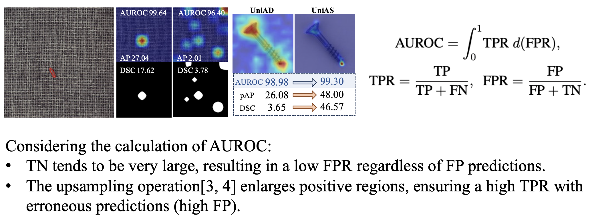
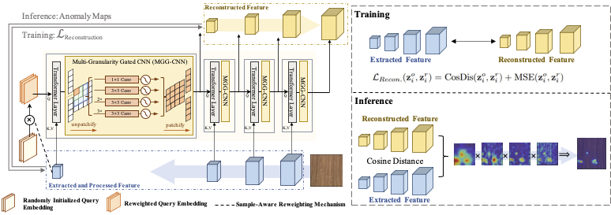
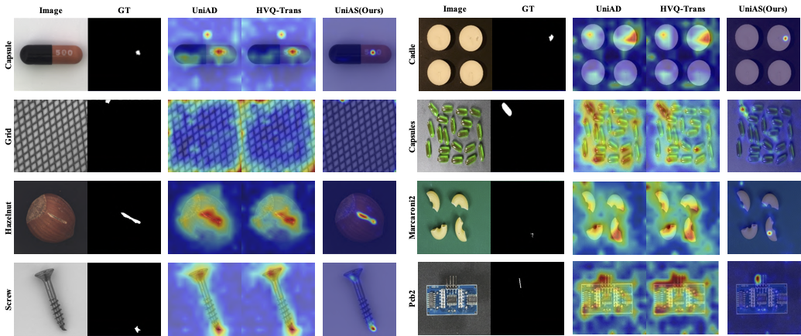

# Towards Accurate Unified Anomaly Segmentation
This is the official PyTorch implementation of \[WACV2025 oral paper\] [**Towards Accurate Unified Anomaly Detection**](https://arxiv.org/abs/2501.12295).

## Abstract
Unsupervised anomaly detection (UAD) from images strives to model normal data distributions, creating discriminative representations to distinguish and precisely localize anomalies. Despite recent advancements in the efficient and unified one-for-all scheme, challenges persist in accurately segmenting anomalies for further monitoring. Moreover, this problem is obscured by the widely-used AUROC metric under imbalanced UAD settings. This motivates us to emphasize the significance of precise segmentation of anomaly pixels using pAP and DSC as metrics. To address the unsolved segmentation task, we introduce the Unified Anomaly Segmentation (UniAS). UniAS presents a multi-level hybrid pipeline that progressively enhances normal information from coarse to fine, incorporating a novel multi-granularity gated CNN (MGG-CNN) into Transformer layers to explicitly aggregate local details from different granularities. UniAS achieves state-of-the-art anomaly segmentation performance, attaining 65.12/59.33 and 40.06/32.50 in pAP/DSC on the MVTec- AD and VisA datasets, respectively, surpassing previous methods significantly.

### Discussion about AUROC
Although AUROC has been widely used in current works, we have discovered a serious problem of AUROC under data-imbalanced situation which would lead to inflated AUORC score. However, anomaly segmentation task tends to be under data-imbalanced situation since anomalous regions often appear rarely with a few pixels.


We argue that, AUROC can effectively reflect false negative predictions \(since it can prevent all-negative predictions\), but it is not a suitable metric to reflect false positive predictions.

### Overview


If you find our work useful, please cite:
```
@misc{ma2025accurateunifiedanomalysegmentation,
      title={Towards Accurate Unified Anomaly Segmentation}, 
      author={Wenxin Ma and Qingsong Yao and Xiang Zhang and Zhelong Huang and Zihang Jiang and S. Kevin Zhou},
      year={2025},
      eprint={2501.12295},
      archivePrefix={arXiv},
      primaryClass={cs.CV},
      url={https://arxiv.org/abs/2501.12295}, 
}
```

## Get Started
### Environment

- numpy == 1.23.5 
- torch == 2.0.1
- torchvision == 0.15.2
- pillow == 9.4.0
- opencv-python == 4.9.0.80
- kornia == 0.6.9
- detectron2 == 0.6
- fvcore == 0.1.5
- tabulate == 0.8.10
- scikit-learn == 1.2.1
- easydict == 1.12
- tensorboard == 2.16.2
- tensorboardx == 2.6.2.2

### Dataset
[MVTec-AD](https://www.mvtec.com/company/research/datasets/mvtec-ad), [VisA](https://github.com/amazon-science/spot-diff) can be downloaded from their official website.

### Scipts
Change the ```DATASET.IMAGE_READER.KWARGS``` in the configuration files in ```configs``` then run ``scripts/train.sh`` to start training. Note that for faster training, we resized the images to target size before iteration.

For evaluation, add the path of weights in ```SAVER.RESUME_MODEL``` in ```configs```.

## Results
The implementation results of current code is:

|Dataset|pixel-AUC|pixel-AP|Dice|(image-AUC)|
|---|---|---|---|---|
|MVTec| 98.29 | 63.53 | 58.83 | 98.63 |
|VisA| 98.61 | 40.05 | 36.67 | 91.39 |

Visualization:


# Acknowledgement and Contact Info
We borrow some codes from [UniAD](https://github.com/zhiyuanyou/UniAD) and [Mask2Former](https://github.com/facebookresearch/Mask2Former).

If you have any problem with this code, please feel free to contact mwxisj@gmail.com